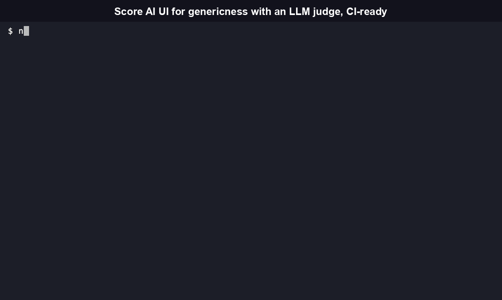
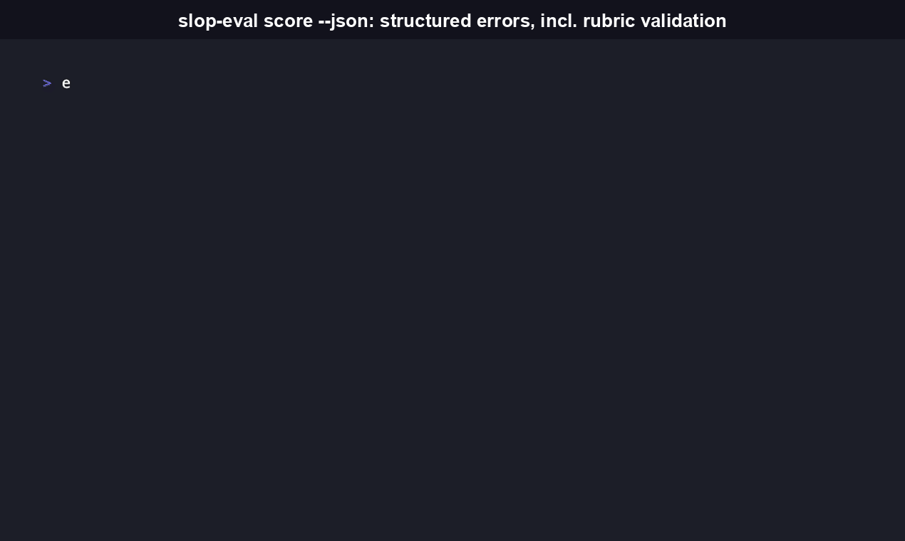

# slop-eval

Score AI-generated UI for genericness with an LLM judge, so a CI check catches the same "this looks like every other AI-built app" problem a human reviewer would flag on sight.

[](https://github.com/RudrenduPaul/slop-eval/actions/workflows/ci.yml)
[](https://www.npmjs.com/package/slop-eval-cli)
[](https://pypi.org/project/slop-eval-cli/)
[](./LICENSE)
[](./package.json)

```bash
npx slop-eval-cli score --screenshot ./preview.png --json
```

No install step: `npx` fetches and runs the published npm package directly. Prefer Python? `pip install slop-eval-cli` gets you the same CLI as a genuine, independent port of the scoring logic.

## Two distributions: npm and Python, both live

`slop-eval-cli` is live on both [npm](https://www.npmjs.com/package/slop-eval-cli) and [PyPI](https://pypi.org/project/slop-eval-cli/) (package `slop_eval`). The Python port is a genuine, independent implementation, built and tested (60/60 tests, verified in this pass) against the same rubric and Anthropic judge prompt as the TypeScript original. See [`python/README.md`](./python/README.md) for Python-specific usage.

## Table of contents

- [Why this exists, and what it isn't](#why-this-exists-and-what-it-isnt)
- [Features](#features)
- [Quickstart](#quickstart)
- [CLI reference](#cli-reference)
- [Library API](#library-api)
- [GitHub Action](#github-action)
- [Honest comparison](#honest-comparison)
- [What a score means (and doesn't)](#what-a-score-means-and-doesnt)
- [The rubric is public and versioned](#the-rubric-is-public-and-versioned)
- [Roadmap](#roadmap)
- [Security](#security)
- [FAQ](#faq)
- [Contributing](#contributing)
- [License](#license)

## Why this exists, and what it isn't

Nutlope's Hallmark, a popular AI design skill with 21,000+ stars, has an open issue where a user says flatly: "all of it looks like slop." The maintainer closed it `NOT_PLANNED`. Separately, a contributor opened a PR against Hallmark titled "Add eval-driven quality harness for Hallmark outputs" that has sat open and unmerged for about two months as of this writing. Both are real and dated as of this writing. Neither proves the demand is large, only that the gap is real and currently unaddressed.

slop-eval is not the first tool in this space, and it doesn't try to be. Two real, free tools already sit nearby:

- **[Impeccable](https://impeccable.style/slop/)** ([pbakaus/impeccable](https://github.com/pbakaus/impeccable), 54,000+ stars, Apache 2.0) ships a CLI that flags 59 specific visual tells of AI-generated UI (gradient palettes, glassmorphism, side-stripe borders, WCAG contrast violations), all enabled by default with no model call; a separate `impeccable critique` command adds further, opt-in LLM-based judgments on top. Core detection stays fast because it doesn't need a model for any of its default checks. It has grown well beyond a slop detector into a full design-language skill for Claude Code, Cursor, and Codex, with 23 commands total.
- **[aislop](https://github.com/scanaislop/aislop)** (MIT, 500+ stars) does the deterministic, rule-based equivalent for AI-generated *code* (not UI): 50+ regex/AST rules across 8 languages, no LLM in the runtime path, positioned exactly as a CI quality gate.

Neither does holistic, judgment-based UI scoring: "does this layout feel novel," "does this component choice feel considered," the kind of read a fixed rule can't easily encode. That's the gap slop-eval fills, built to compose with tools like Impeccable's rather than replace them.

## Features

Verified directly against the code in this repo:

- **Three rubric categories, each with mandatory cited evidence.** `src/rubric/v1.json` scores layout novelty, visual-identity distinctiveness, and component-pattern novelty, 0-10 each. A finding with no specific citation is treated as a bug, not a valid score (see `src/sources/RuleSource.ts`).
- **LLM judge via forced tool-call, returning structured JSON.** `LLMJudgeSource` calls the Anthropic API with `tool_choice` locked to a `submit_slop_scores` schema: the response comes back as reliably structured JSON instead of a chat reply that has to be regexed apart.
- **`--json` mode for CI and agents.** Every run can emit a parseable `{ target, rubric, compositeScore, findings[], summary, disclaimer }` object on stdout, on both success and error paths, so a script or agent never has to branch on shape to find an error string.
- **Real exit-code contract.** `0` success (no threshold, or score at/above `--fail-below`), `1` success but below threshold, `2` usage error or unrecoverable failure. Verified directly against the built CLI and the real npm/PyPI packages this session; see [CLI reference](#cli-reference).
- **Content-hash caching.** `src/cache/judge-cache.ts` hashes the input bytes and skips the API call entirely on a repeat run against unchanged input. That's a correctness guarantee as much as a cost saver: an unchanged PR can't flap a CI gate from LLM run-to-run variance.
- **Composable `RuleSource` plugin interface.** `src/sources/RuleSource.ts` is the boundary every scoring source implements. Today that's one real source (`LLMJudgeSource`) and one documented stub (`ScreenshotDiffSource`, honestly reported as `not_scored` until a real labeled corpus exists), so a future rule catalog or a second LLM provider slots in without touching the composite scorer.
- **Screenshot input (real visual read) or `--url` fallback.** `--screenshot` sends the actual rendered image to the judge. `--url` is a documented v0.1 limitation: no bundled headless browser, so it fetches raw HTML/text and the judge reasons over markup and copy instead of layout.
- **GitHub Action that leads with the specific flag, then the score.** `action/action.yml` posts a PR comment headed by the single most specific flagged finding, followed by the composite score, giving a reviewer the reasoning behind the number.
- **Versioned, public rubric.** Every score names the rubric version (`v1` today) that produced it. Rubric changes ship as a new file, never a silent edit to an existing one.
- **A real, agent-native library API alongside the CLI.** Both distributions export a programmatic entry point (`score_composite` and friends in Python, `runScore`/`scoreComposite` in TypeScript) so an agent framework can call slop-eval in-process instead of shelling out. See [Library API](#library-api).

## Quickstart

Requires Node.js 18+ (npm) or Python 3.9+ (PyPI), and an `ANTHROPIC_API_KEY` (BYO key; get one at [console.anthropic.com](https://console.anthropic.com/)).



The fastest path, no local clone or build needed, is the one-liner at the top of this README:

```bash
npx slop-eval-cli score --screenshot ./preview.png --json
```

Verified this session against the real published npm package, with a real PNG at `./preview.png` and no `ANTHROPIC_API_KEY` set:

```bash
$ npx --yes slop-eval-cli@latest score --screenshot ./preview.png --json
{
  "error": "ANTHROPIC_API_KEY environment variable is not set.\nslop-eval calls the Anthropic API to run the LLM judge, and is BYO-key (bring your own key) -- there is no default or shared key baked into this tool. Set your key and try again:\n\n  export ANTHROPIC_API_KEY=\"sk-ant-...\"\n\nGet a key at https://console.anthropic.com/"
}
# exit code 2
```

To build from source instead:

```bash
git clone https://github.com/RudrenduPaul/slop-eval.git
cd slop-eval
npm install
npm run build

export ANTHROPIC_API_KEY="sk-ant-..."
./dist/cli.js score --screenshot ./test/fixtures/sample.png
```

For CI or agent consumption, add `--json`. `--json` always emits a valid JSON object on stdout, on both the success and error paths, and the `--url`/`--screenshot` mutual-exclusivity check is a good example of a real usage-error path you can rely on being parseable:



```bash
./dist/cli.js score --screenshot ./test/fixtures/sample.png --json
```

```json
{
  "target": "./test/fixtures/sample.png",
  "rubric": "v1",
  "compositeScore": 62,
  "findings": [
    {
      "ruleId": "llm-judge.layout-novelty",
      "category": "Layout novelty",
      "score": 4,
      "evidence": "Matches a common hero + 3-card grid + footer CTA pattern.",
      "status": "flag"
    }
  ],
  "summary": { "pass": 1, "flagged": 1, "notScored": 1 },
  "disclaimer": "This score is a heuristic quality signal from an LLM judge, not a certification..."
}
```

## CLI reference

Captured directly from `./dist/cli.js score --help` on the built CLI this session, word for word:

```
Usage: slop-eval score [options]

Score a URL or screenshot for AI-UI genericness against a versioned rubric.

Note on --url mode (v0.1 limitation): this tool does not bundle a headless
browser. If --url is given, the raw HTML/text response is fetched and given to
the judge as a fallback input, instead of a rendered screenshot -- the judge
can reason about markup and copy, but not the actual visual layout. For the
stronger, layout-aware signal, render the page yourself and pass --screenshot.

Options:
  --url <url>          URL to score (fetched as raw HTML/text -- see
                        limitation note above)
  --screenshot <path>  path to a screenshot image to score (preferred over
                        --url)
  --rubric <name>       rubric version to use, reads src/rubric/<name>.json
                        (default: "v1")
  --json                output structured JSON instead of a human-readable
                        report (default: false)
  --fail-below <n>      exit code 1 if the composite score is below this
                        threshold (0-100); no threshold by default
  -h, --help             display help for command
```

Exit codes: `0` success (no threshold, or score at/above `--fail-below`), `1` success but below threshold, `2` usage error or unrecoverable failure (missing API key, unreadable file, malformed rubric, mutually exclusive `--url`/`--screenshot`).

`--url` and `--screenshot` are mutually exclusive; passing both or neither is a usage error (exit 2) in either output mode. Both verified directly against the built CLI this session.

**`--url` limitation (v0.1, by design):** no bundled headless browser. `--url` fetches raw HTML/text and hands it to the judge as a text fallback, reasoning over markup and copy rather than the rendered layout. `--screenshot` is the stronger signal; render the page yourself (Playwright, Puppeteer, or your CI's existing preview-screenshot step) and pass the image.

The Python CLI (`slop-eval` console script, installed via `pip install slop-eval-cli`) exposes the identical flag set and exit-code contract, confirmed against its own `--help` output this session.

## Library API

Both distributions export a real, documented programmatic entry point in addition to the CLI. This is the interface an agent framework or CI script calls in-process instead of shelling out.

**Python** (`slop_eval/__init__.py`):

```python
from slop_eval import score_composite, ScoreInput, LLMJudgeSource, ScreenshotDiffSource

sources = [LLMJudgeSource("v1"), ScreenshotDiffSource()]
result = score_composite(sources, ScoreInput(screenshot_path="./preview.png"))
print(result.composite_score, result.findings)
```

`score_composite(sources: List[RuleSource], score_input: ScoreInput) -> CompositeResult` runs every `RuleSource` in list order, flattens their findings, and returns a `CompositeResult` with `composite_score: float` (0-100) and `findings: List[RuleFinding]`. Also exported: `RuleFinding`, `RuleFindingStatus`, `RuleSource`, `Rubric`, `RubricCategory`, `load_rubric`, `build_json_report`, `render_human_report`, `print_report`, `print_error`, `MissingApiKeyError`, `RubricLoadError`.

**TypeScript** (`src/cli.ts`, exported from the package's `main`/`types` entry): `runScore(options: ScoreOptions, buildSources?) => Promise<number>` and `buildProgram(): Command` are the two exported entry points, along with the `ScoreOptions` interface. `scoreComposite` (from `src/scorer/composite.ts`) is the same composite-scoring function the CLI calls internally. These exist primarily so the test suite can drive the CLI in-process; the Python package's `__init__.py` is the more deliberately documented "agent-native" library surface of the two.

## GitHub Action

```yaml
- uses: RudrenduPaul/slop-eval/action@main
  with:
    url: ${{ steps.deploy.outputs.preview_url }}
    fail-below: 50
  env:
    ANTHROPIC_API_KEY: ${{ secrets.ANTHROPIC_API_KEY }}
```

Posts a PR comment leading with the most specific flagged finding, then the composite score. Requires `permissions: pull-requests: write` in the calling workflow. Full input/output reference in `action/README.md`.

## Honest comparison

| | slop-eval | Impeccable | aislop |
|---|---|---|---|
| Target | AI-generated **UI** | AI-generated **UI** | AI-generated **code** |
| Detection method | LLM judge (holistic) | Deterministic rules, 59 checks by default; separate `critique` command adds further, opt-in LLM judgments | Deterministic rules (50+ checks) |
| Requires an API key | Yes (BYO Anthropic key) | No, for the 59 default deterministic checks | No |
| Speed | Slower by design, a real model call is in the critical path | Near-instant for the deterministic checks | Sub-second, no network call |
| Composable rule sources | Yes, `RuleSource` plugin interface | No (fixed rule set) | No (fixed rule set) |
| GitHub stars | New (this repo) | 54,000+ | 500+ |
| License | Apache 2.0 | Apache 2.0 | MIT |
| CI-gate model | GitHub Action, `--fail-below` threshold | Not primarily positioned as a CI product | Yes, CI quality gate |

Want fast, deterministic, zero-cost checks for known AI-UI tells? Impeccable's tool is the better fit today, and by star count and scope it's the more established project by far. For a holistic judgment call on layout and component novelty that a fixed rule set can't easily encode, that's what slop-eval adds. Nothing stops you from running both in the same CI job.

**On speed:** slop-eval is genuinely slower than Impeccable's core checks and aislop, because an LLM call sits in the critical path. Real, measured CLI-overhead numbers from a fresh clone and build, taken this session (`--help` and error paths, no scoring call):

| Command | Real measured time |
|---|---|
| `slop-eval score --help` | ~0.05s |
| `slop-eval score --screenshot <x>` (no API key, fails fast, local file read only) | ~0.05s |
| `slop-eval score --url <x>` (no API key, fails fast) | 0.18s-0.91s, varies with network latency since this path fetches the URL before the key check runs |

The actual scored-run latency (a real LLM-judge call, fresh vs. cached) requires a live `ANTHROPIC_API_KEY` this environment doesn't have, so these two numbers are **targets pending a real measured run**: under 10 seconds fresh, under 1 second on a cache hit for identical input. The cache-hit number is guaranteed by the content-hash cache logic in `src/cache/judge-cache.ts`; the fresh-run number is an estimate. We would rather label a target as a target than assert a number we can't reproduce.

## What a score means (and doesn't)

A slop-eval score is a heuristic quality signal from one LLM's read of your UI against a stated rubric. It is not a certification that something is or isn't AI-generated, and a clean score doesn't mean the UI is good by every measure, only that this rubric, at this version, didn't flag it.

## The rubric is public and versioned

Every score is graded against `src/rubric/v1.json`, a real, versioned file you can open and read directly. Read it, propose changes, or pin a specific version with `--rubric`. A rubric version is never edited in place; a change ships as a new file so a historical score always records which rubric produced it.

## Roadmap

- **v0.1 (this release):** LLM-judge scoring, CLI, GitHub Action, content-hash caching, `--json` mode, library API on both distributions.
- **v0.2:** `ScreenshotDiffSource` becomes real once a genuine labeled corpus exists. An Impeccable-catalog adapter, pending a license check. Explicit `rescore --rubric v2` command so a rubric bump is never silent.

## Security

`ANTHROPIC_API_KEY` is read from the environment only, is never logged, and is never written to the content-hash cache -- see `SECURITY.md` for the full policy and the private disclosure process.

## FAQ

**What is slop-eval, and how is it different from a linter?** It's a CLI, GitHub Action, and library that scores AI-generated UI for genericness ("slop") using an Anthropic LLM judge against a versioned rubric (`src/rubric/v1.json`), instead of a fixed set of deterministic pattern checks. It's built to catch the "this looks like every other AI-built app" read a human reviewer gives on sight, and to run alongside a deterministic linter in the same CI job or agent loop.

**Do I need an API key?** Yes. slop-eval is bring-your-own-key against the Anthropic API; there's no shared or hosted key. Nothing is sent anywhere except Anthropic's API.

**How do I install it, and what platforms does it support?** Two independent distributions, both verified installable and runnable this session. npm: `npx slop-eval-cli score ...` (no install) or `npm install -g slop-eval-cli`, requiring Node.js 18+ (see `engines` in `package.json`). PyPI: `pip install slop-eval-cli`, requiring Python 3.9-3.13 (see the classifiers in `python/pyproject.toml`). Neither package has a native binary or a platform-specific build step, so both install the same way on macOS, Linux, and Windows.

**How does slop-eval compare to Impeccable specifically?** See the [Honest comparison](#honest-comparison) table above for the full breakdown. In short: Impeccable's core is 59 deterministic checks, all enabled by default, that need no API key and run near-instantly, and the project itself has grown into a much larger design-language skill (54,000+ stars, 23 commands) beyond just slop detection; a separate `critique` command adds further LLM judgments on top of the deterministic set. slop-eval is a single LLM-judge call that needs a BYO Anthropic key and is slower by design, because a real model call sits in the critical path, in exchange for holistic layout/component judgment a fixed rule can't easily encode. They're built to run together in the same CI job.

**Can I use a different model provider (OpenAI, Gemini)?** Not in v0.1. `LLMJudgeSource` calls the Anthropic API directly; `ANTHROPIC_MODEL` only lets you pick a different Anthropic model. A pluggable provider is a natural fit for the `RuleSource` interface later, but it isn't built yet, so don't take "composable rule sources" to mean "multi-provider" today.

**Does `--url` render the page like a browser would, and what if my score run fails?** No, not in v0.1. `--url` fetches the raw HTML/text response and hands that to the judge as a fallback; render the page yourself and pass `--screenshot` for a real visual read. For failures generally: every error path, including a missing `ANTHROPIC_API_KEY`, exits with code `2` and prints a clear message (a JSON `{"error": ...}` object in `--json` mode), so a failed run should always tell you exactly what to fix.

**Will re-running slop-eval on the same PR flap the CI check?** No. Identical input (same screenshot bytes, or same URL plus fetched content) hits the content-hash cache in `src/cache/judge-cache.ts` and never re-calls the API, so the same input always returns the same cached result.

**Is `screenshot-diff-vs-corpus` a real check today?** No. It's a real `RuleSource` implementation in the code, but v0.1 ships it as an honest `not_scored` stub because no labeled comparison corpus exists yet. Hand-seeding an unvalidated corpus would be a less honest signal than reporting "not scored." Corpus-backed diffing is planned for v0.2.

**Can I use slop-eval commercially, including in a closed-source product?** Yes. Both distributions are Apache 2.0 (`LICENSE`, `python/LICENSE`), a permissive license that allows commercial use, modification, and closed-source redistribution, and includes an express patent grant. Calling the CLI, Action, or library from a closed-source project doesn't obligate you to open anything up; the license and copyright notice just need to ship with redistributed copies of slop-eval's own code.

## Contributing

Issues and PRs welcome, see `CONTRIBUTING.md` (covers both the npm and Python packages, including per-package coverage requirements). New `RuleSource` implementations are the highest-leverage contribution: the plugin interface exists specifically so a new detection method doesn't require touching the composite scorer.

## License

Apache 2.0. See `LICENSE`.
